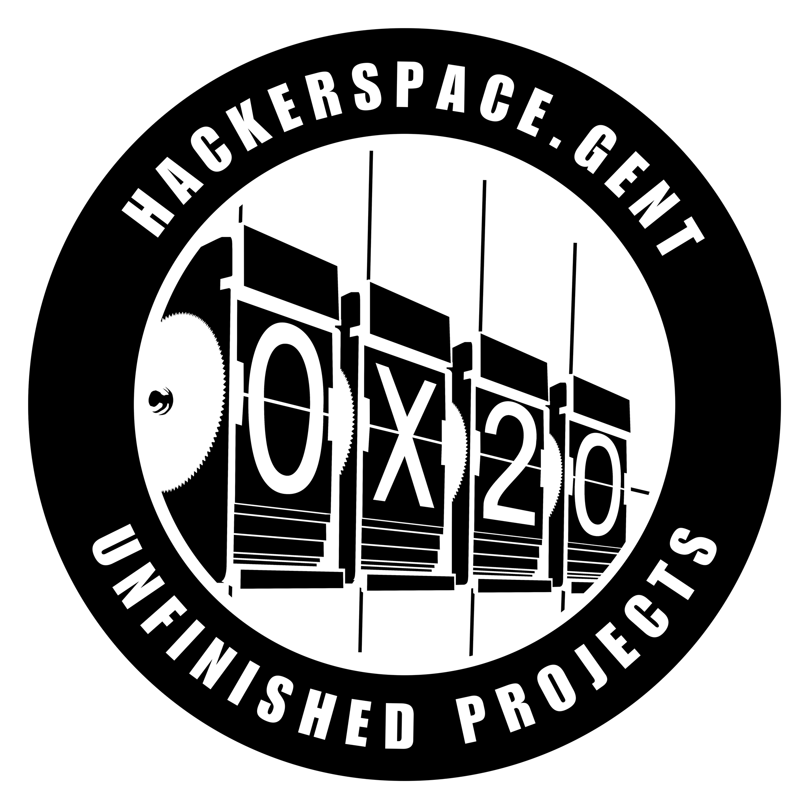

# HSG Canvas

<p align="center">
  
</p>

**Hackerspace.gent Canvas** — a FastAPI-powered media hub that turns a Raspberry Pi into a shared display and audio server for the space. YouTube, audio streams, Spotify now-playing, Chromecast, Bluetooth A2DP, background images, and QR codes all in one place.

## What it does

- 📺 **Display** — YouTube, images, QR codes, and a synthwave web control panel rendered via Chromium kiosk
- 🎵 **Audio** — browser-based audio streams with an audio-conflict manager (only one source at a time)
- 🎧 **Spotify** — live now-playing view driven by librespot/raspotify webhooks, pushed to a React display over WebSocket
- 📡 **Chromecast** — discovers Cast devices on the network and redirects output
- 🔊 **Bluetooth A2DP sink** — Pi doubles as a speaker, with AVRCP metadata surfacing in the UI
- 🏠 **Home Assistant** — custom events + raw WebSocket broadcast for automations

## Stack

FastAPI · Pydantic · WebSockets · Chromium kiosk (via cage/Wayland) · Vite + React (Spotify display) · Angie reverse proxy · systemd · PipeWire

## Architecture (short version)

`main.py` wires everything up in a FastAPI lifespan: a `DisplayStack` owns the screen, `ChromiumManager` launches the browser once at boot, and managers (Playback, Audio, Spotify, Chromecast, Background, OutputTarget, …) coordinate over shared references. Every route group in `routes.py` is a `setup_*_routes()` factory returning an `APIRouter`.

```
┌─ Angie :80 ──────────────────────────────┐
│  /         → FastAPI :8000  (control)    │
│  /spotify/ → Vite :5173     (display)    │
│  /ws/*     → FastAPI :8000  (events)     │
└──────────────────────────────────────────┘
```

## Running it

```bash
pip3 install -r requirements.txt
python3 main.py              # dev, port 8000
./start.sh                   # production (Vite + FastAPI)
sudo ./setup.sh              # one-time Pi provisioning
pytest tests/                # tests
```

Full deployment notes, systemd/Angie config, and gotchas live in [`CLAUDE.md`](CLAUDE.md) and [`INSTALL.md`](INSTALL.md).

## License

Built for and by [Hackerspace.gent](https://hackerspace.gent) — 0x20, unfinished projects.
